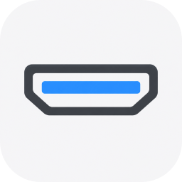
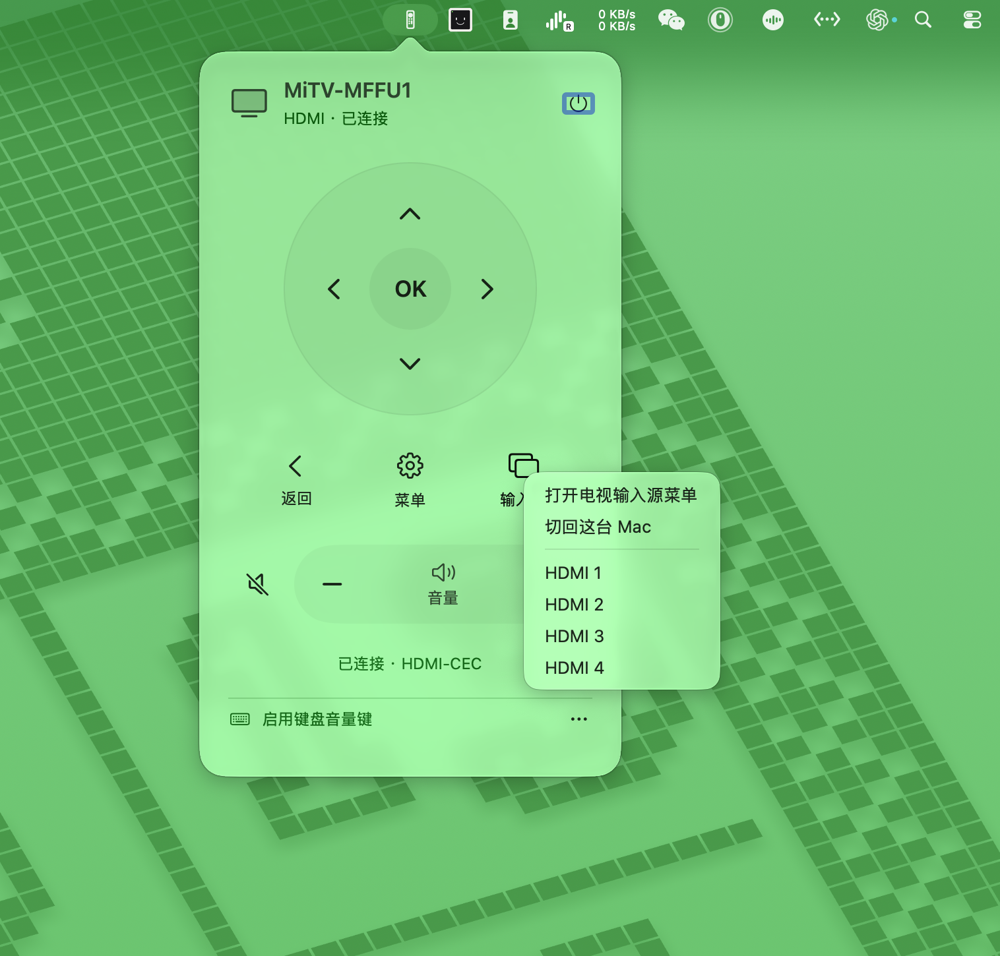
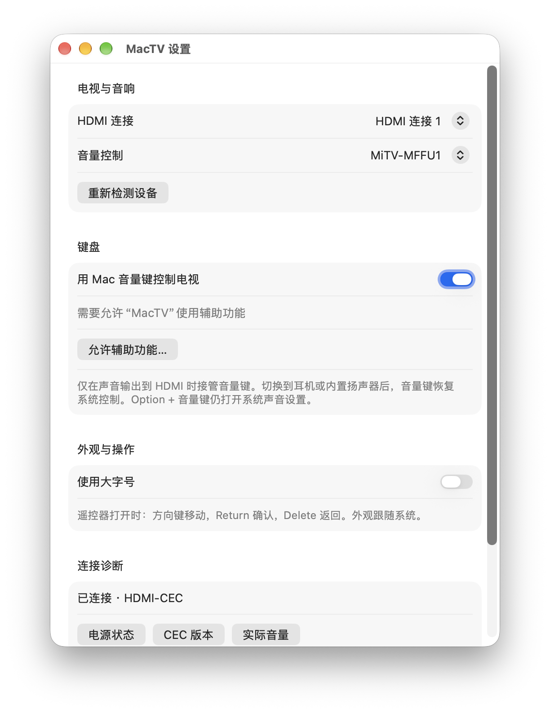

<p align="center"><strong>简体中文</strong> · <a href="README.en.md">English</a></p>

<div align="center">
  
  <h1>MacTV · 电视遥控</h1>
  <p>让电视更好用作 Mac 显示器。</p>
  <p>用 Mac 控制电视，也用电视遥控器控制 Mac。通过 HDMI-CEC 连接，无需 Wi-Fi。</p>
  <p>
    
    
    <a href="LICENSE"></a>
  </p>
  <p><a href="https://github.com/pengchujin/MacTV/releases/download/v0.1.2/MacTV-v0.1.2-macOS-arm64.dmg"></a></p>
  <p><a href="docs/COMPATIBILITY.md">设备兼容性</a> · <a href="https://github.com/pengchujin/MacTV/issues">反馈问题</a></p>
  <br>
  
  <p><sub>MacTV 实机界面 · MiTV-MFFU1</sub></p>
</div>

## Mac 与电视，双向遥控

MacTV 是一款 Mac 菜单栏应用，让你用熟悉的音量键调节电视音量，也能从菜单栏控制电视电源、菜单和输入源。反过来，电视遥控器也能用来控制 Mac 的播放、切歌、切换应用，以及移动鼠标和点击。具体功能取决于电视和 Mac 的支持情况。

- **键盘音量键** — HDMI 音频输出时，使用 Mac 的音量加减和静音键。
- **用电视遥控器控制 Mac** — 媒体模式支持切歌、播放暂停和切换应用；鼠标模式支持移动、长按加速、6 档速度和长按确认后松开右击。返回键映射为 Esc。需在设置中开启，按键支持取决于电视。
- **菜单栏遥控器** — 方向、确认、返回，以及电视支持的唤醒、待机和菜单操作。
- **输入源** — 请求切回这台 Mac，或切换 HDMI 输入；实际效果取决于电视。
- **原生体验** — 浅色与深色外观、VoiceOver，支持简体中文、繁体中文和英文。

打开下载的 DMG，将 MacTV 拖入「应用程序」即可安装。

## Homebrew 安装

```sh
brew install --cask pengchujin/tap/mactv
```

安装后打开「应用程序」中的 MacTV。更新时运行：

```sh
brew update
brew upgrade --cask pengchujin/tap/mactv
```

## 三步开始

**1 · 连接电视**

使用支持 CEC 的 Mac HDMI 接口或转换器连接电视，并开启电视的 HDMI-CEC。不同品牌可能称为 SIMPLINK、Anynet+ 或 BRAVIA Sync。

**2 · 打开遥控器**

启动 App，点击菜单栏的遥控器图标。使用方向键移动、Return 确认、Delete 返回；“输入源”中保留切回 Mac 和 HDMI 1–4 选项。

**3 · 启用键盘音量键**

打开 App 设置，开启“用 Mac 音量键控制电视”，并在 macOS「隐私与安全性 → 辅助功能」中允许 App。切换到耳机或内置扬声器后，音量键恢复系统控制。

<p align="center">
  
</p>

## 使用前了解

需要 **Apple Silicon Mac、macOS 14+ 和支持 CEC 的 HDMI 连接**；转换器路径的官方要求为 macOS 14.4+。并非所有 Mac 的 HDMI 接口或扩展坞都支持，见 [Apple 支持范围](https://support.apple.com/zh-cn/108928)。

这是早期版本。不同电视对菜单和输入源指令的响应不同；**已发送不等于电视已执行**。当前 REDMI 实测可以切回 Mac，快捷调整面板和其他输入直切仍待适配。HDMI 1–4 是预设请求，不代表检测到了四个输入设备。详见[兼容性说明](docs/COMPATIBILITY.md)。

App 直接使用 macOS 非公开 IOKit 接口发送 CEC，接口可能随系统更新变化。不依赖 BetterDisplay，不提供 Wi-Fi 控制，也不包含遥测。诊断记录保存在本机；分享前请检查其中的设备名称。

## 自己构建

打开 `MacTV.xcodeproj`，选择 **MacTV** scheme，在 Signing & Capabilities 中选择自己的开发者团队，然后运行或 **Product → Archive**。

```sh
swift test
python3 scripts/validate-localizations.py
```

Xcode 工程已包含在仓库；修改 `project.yml` 后可用 [XcodeGen](https://github.com/yonaskolb/XcodeGen) 重新生成。公开分发的签名、公证及验证步骤见[发布说明](docs/RELEASING.md)。

---

<p align="center">SwiftUI + AppKit · HDMI-CEC · <a href="LICENSE">MIT</a></p>
